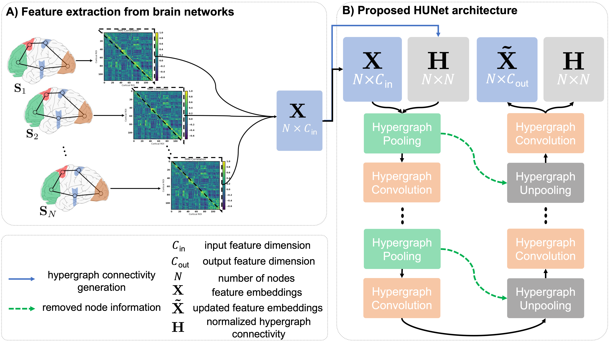
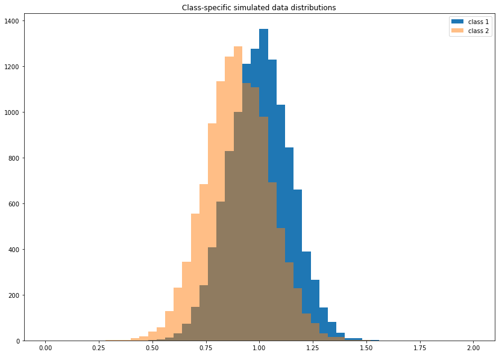

# HUNet (Hypergraph U-Net)
Deep hypergraph U-Net for brain graph embedding and classification code by Mert Lostar. Please contact mertlostar@gmail.com for inquiries. Thanks.

Recently, there has been a surge of interest in deep graph neural networks,
  given their remarkable capacity to model the deeply nonlinear relationship between data samples (i.e.  connectomes) 
  rooted in message passing, aggregation, and composition rules between node connectomic features.
  However, a major limitation of current deep graph embedding architectures is that they 
  are unable to capture many-to-many (i.e., high-order) relationships between samples, hence the learned feature embeddings 
  only consider node-to-node edges in the population graph. Our framework aims to infer and aggregate node embeddings while exploring the 
  global high-order structure present between subsets of data samples, 
  becoming more gnostic of real data complexity.  

## Details of the proposed HUNet framework
**A)** Each brain network *S<sub>i</sub>* of subject *i* is encoded in a connectivity matrix,
 which is vectorized by extracting *C<sub>in</sub>* connectivity weights stored in 
 its off-diagonal upper triangular part. We stack all *N* samples into *X* with *C<sub>in</sub>* rows.
  **B)** Using *X*, we generate the normalized hypergraph connectivity matrix *H*. *H* and *X* are used 
  as inputs for the proposed HUNet architecture, stacking our proposed hypergraph pooling (hPool) 
  and unpooling (hUnpool) layers with hypergraph convolution layers. Connectivity information of 
  the removed nodes at hPool layer at HUNet level *d* are transferred to the hUnpool layer at the same level to be used 
  when up-sampling *X* and restoring *H*. Outputs of the HUNet are the learned feature embeddings which can be used for 
  the target learning task.  Experimental results and comparisons with the state-of-the-art methods demonstrate that HUNet
   can outperform state-of-the art geometric graph and hypergraph data embedding techniques with a gain of *4-14%* in classification accuracy,
    demonstrating both scalability and generalizability. We evaluated our proposed framework on the 
    ABIDE preprocessed dataset (http://preprocessed-connectomes-project.org/abide/) and a subset of the ADNI GO public dataset (http://adni.loni.usc.edu/).


## Demo
### Requirements
HUNet is coded in Python 3. A GPU and CUDA 10.2 is required to run this code.
To install requirements:

```setup
conda env create -f environment.yml
```
### Data preperation

We simulated random brain graph datasets drawn from two Gaussian distributions, each representing a data class, using the function simulate_data.py. 
The number of class 1 brain graphs, the number of class 2 brain graphs and the number of ROI's in these brain graphs (at least 20) are manually inputted by the user when starting the demo.
Also, the user needs to specify the normal distribution parameters (the mean mu and the standard deviation sigma) in config.yaml file.
To train and evaluate the HUNet code on other datasets, you need to provide:
<ul>
<li> A numpy array of size (N × C) stacking the feature vectors of the subjects. N denotes the total number of subjects and C denotes the input feature dimension.</li>
<li> A vector of size N stacking the training labels.</li>
<li> idx_trains: the indices of the training samples.</li>
<li> idx_vals: the indices of the validation samples.</li>
<li> idx_test: the indices of the test samples.</li>
</ul>

### Train and test BGSR

To evaluate our framework, we use 5 fold cross validation on %80 of the data and select the 2 models with the lowest 
value loss and highest validation accuracy. We then evaluate these models on the test set consisting of the remaining %20 and report the testing accuracy.

To test our code, you can run: train_and_evaluate.py
## Example Results

For our tests we initialize the data simulation parameters in config.yaml as:

```
#Data simulation parameters
mu1: 1
sigma1: 0.2
mu2: 0.9
sigma2: 0.21
```
To simulate the class distributions below:


### Small-scale brain graph dataset simulation
To simulate a small-scale brain graph dataset, we set the number of class 1 and class 2 brain graphs as 20 with the number of ROI's as 35. 
To train and evaluate HUNet on a simulated small-scale brain graph dataset, initialize the model parameters in the config.yaml file as:
```
# model parameters
model: HUNET              # model name
k_construct_nn: 4      # for data without inherent graph structure
n_stack: 1           # Number of stacked HU-Nets
layer_spec: [64] # Reduced feature dimension
hunet_depth : 3 #Depth of the HU-Nets
pool_ratios: 0.5 #Pooling ratio to be used in the hPool layers

```
### Large-scale brain graph dataset simulation
To simulate a large-scale brain graph dataset, we set the number of class 1 and class 2 brain graphs as 250 with the number of ROI's as 120. 
To train and evaluate HUNet on a simulated large-scale brain graph dataset, we increase the depth of the HUNet and decrease the pooling ratio, meaning that we keep less nodes in each HUNet level.
```
# model parameters
model: HUNET              # model name
k_construct_nn: 4      # for data without inherent graph structure
n_stack: 1           # Number of stacked HU-Nets
layer_spec: [64] # Reduced feature dimension
hunet_depth : 4 #Depth of the HU-Nets
pool_ratios: 0.4 #Pooling ratio to be used in the hPool layers

```

### Results

Our model achieves the following performance on the simulated brain graph datasets:

| Simulated dataset         | Accuracy  | Sensitivity | Specificity|
| ------------------ |---------------- | -------------- | --------------
| Large-scale   |     76%         |      79%       |      73%       |
| Small-scale   |     88%         |      80%       |      100%       |

